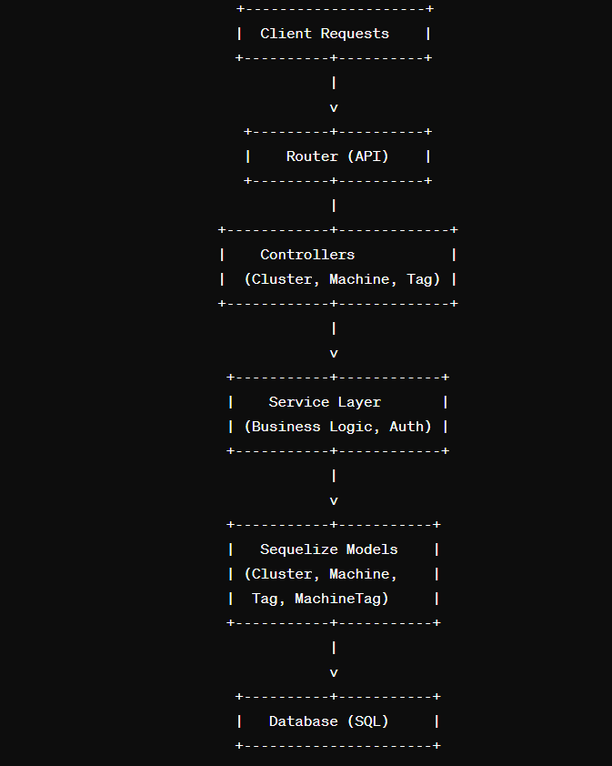
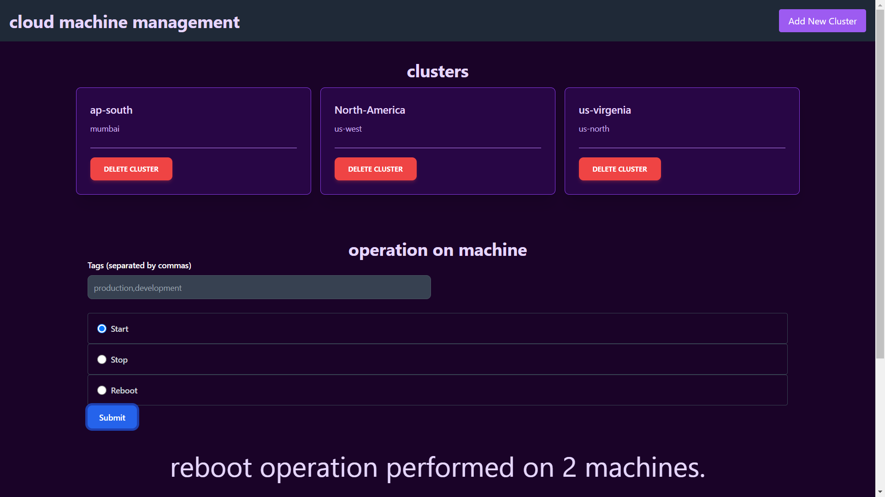
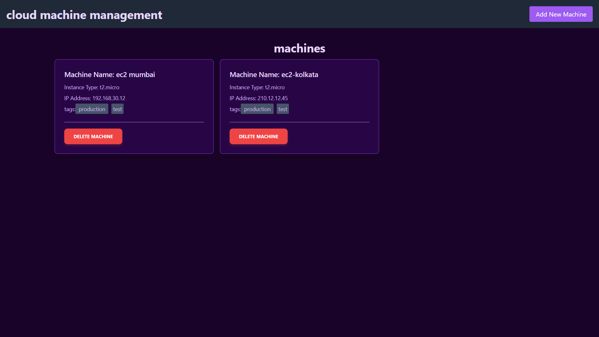
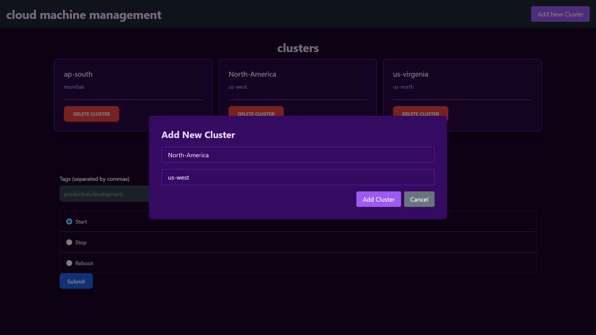
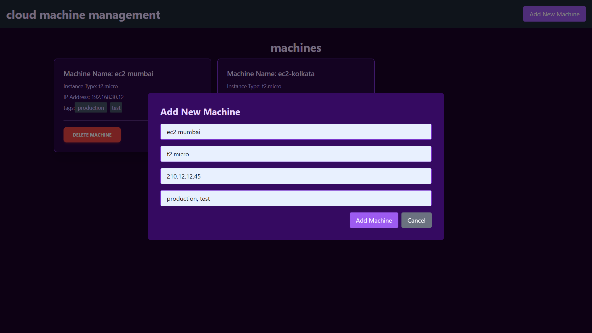
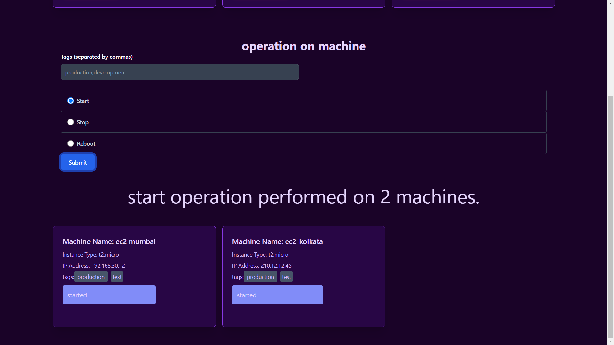

<h2 align='center'>Visualization Dashboard</h2>
<p align="center">
<a href="https://github.com/saurabh-kud"></a>
</p>

<p align="center">
<a href="https://github.com/saurabh-kud"></a>
<a href="https://github.com/saurabh-kud/cloud-management/network/members"></a>
<a href="https://github.com/saurabh-kud/cloud-management/issues">
</a>

</p>

<p align="center">
    cloud Management - manage you machine
</p>

## api-postman-docs 🔗

[https://documenter.getpostman.com/view/25265039/2sA3JGe3ME](https://documenter.getpostman.com/view/25265039/2sA3JGe3ME)

## live-link 🔗

[https://manage-cloud.netlify.app/](https://manage-cloud.netlify.app/)

# task

There will be multiple clusters and each cluster will have zero or more machines.
Each machine will have zero or more tags. Also, each cluster will have a name and a
cloud region, each machine will have a name, ip address, and instance type.

The system should allow users to create clusters, create machines in a cluster, add
tags to the machine when creating them, delete machines and clusters and perform
operations like start, stop and reboot on a group of machines using tags.

# Problem Statement

Your API should do everything required to manage the clusters and machines, except
actually create the machines in the cloud.

# Bonus Added

- Added Basic Frontend to demonstrate the full wokking api

# tech stack used

Backend

- nodejs, express ,sequlize, sequlize Cli

Database

- mySql

Fronted

- html, css, js, React

## Installation

```sh

# Clone the repo
$ git clone https://github.com/saurabh-kud/cloud-management.git


# Install
$ npm install

# Setting Up ENV
> setup .env file for database and access token

PORT=3000
USERNAMEDB=root
DATABASE=db_naem
HOST=127.0.0.1
PASSWORD=your_password


# Start
$ npm start

# Access your app
$ http://localhost:${PORT}

```

# Screenshot

- dfd Diagram

<br/>
<div align="center">
  
</div>
<br/>

- Backend Service Flow Diagram
<div align="center">
  
</div>
<br/>

- Frontend
<div align="center">
  
</div>
<br/>
<div align="center">
  
</div>
<br/>
<div align="center">
  
</div>
<br/>
<div align="center">
  
</div>
<br/>
<div align="center">
  
</div>
<br/>

## Author

👤 **Saurabh kumar**

- Github: [@saurabh-kud](https://github.com/saurabh-kud)
- LinkedIN: [@saurabh-kud](https://www.linkedin.com/in/saurabh-kud/)

---

## License

&copy; Saurabh Kumar | MIT
